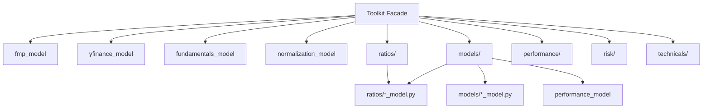

# FinanceToolkit 模块结构分析报告

> 项目：[JerBouma/FinanceToolkit](https://github.com/JerBouma/FinanceToolkit)  
> 本地路径：`FinanceToolkit/`  
> 版本：2.0.7（`pyproject.toml`）  
> 定位：开源透明财务分析工具包，强调 **150+ 指标公式可审计**，统一从 FMP / Yahoo Finance 拉数并标准化报表字段

---

## 1. 顶层目录树

```
FinanceToolkit/
├── pyproject.toml              # 包配置、依赖
├── README.md                   # 文档与用法示例
├── financetoolkit/             # 主 Python 包
├── examples/                   # Jupyter 教程（0~11）
│   └── external_datasets/      # 自定义报表 CSV 示例
├── tests/                      # pytest 测试（按模块分子目录）
└── .github/workflows/          # CI
```

---

## 2. 架构模式

采用 **Controller + Model** 分层：

| 层级 | 职责 | 典型路径 |
|------|------|----------|
| 入口 / Facade | 数据获取、缓存、子模块懒加载 | `toolkit_controller.py` |
| Controller | 编排数据、批量 ticker、growth/trailing | `*/ *_controller.py` |
| Model | 纯函数计算（pandas Series/DataFrame 入参） | `*/ *_model.py` |
| 数据适配层 | 外部 API 封装 | `fmp_model.py`, `yfinance_model.py` |
| 基础设施 | 日志、缓存、错误处理 | `utilities/` |
| 报表标准化 | FMP/YF 字段映射 CSV | `normalization/` |



---

## 3. `financetoolkit/` 包结构

```
financetoolkit/
├── __init__.py                 # 导出 Toolkit, Economics, FixedIncome, Discovery, Portfolio
├── toolkit_controller.py       # 核心类 Toolkit（~3800 行）
├── fmp_model.py                # Financial Modeling Prep API
├── yfinance_model.py           # Yahoo Finance 回退
├── fundamentals_model.py       # 三表聚合拉取 + 标准化
├── historical_model.py         # OHLCV / 收益率 / 波动率
├── normalization_model.py      # 报表字段归一化
├── currencies_model.py         # 跨币种报表换算
├── helpers.py                  # growth、portfolio 等工具
├── normalization/              # balance/income/cash 映射表
├── utilities/                  # cache, error, logger
├── ratios/                     # 五类财务比率（150+）
├── models/                     # DuPont、DCF、WACC、Altman、Piotroski 等
├── performance/                # CAPM、Sharpe、Fama-French 等
├── risk/                       # VaR、cVaR、GARCH、最大回撤
├── technicals/                 # 技术指标（~50）
├── options/                    # Black-Scholes、Greeks
├── fixedincome/                # 债券定价、FRED/ECB/NY Fed 利率
├── economics/                  # OECD + Global Macro Database
├── discovery/                  # FMP 选股/搜索
└── portfolio/                  # 个人持仓分析
```

---

## 4. 核心类与职责

### 4.1 公共入口

```python
from financetoolkit import Toolkit, Economics, FixedIncome, Discovery, Portfolio
```

### 4.2 `Toolkit`（`toolkit_controller.py`）

统一入口；管理 ticker、日期、API Key、缓存、数据源策略；通过 `@property` 懒加载分析子模块。

**主要数据方法：**

| 方法 | 说明 |
|------|------|
| `get_historical_data()` | 日/周/月/季/年 OHLCV |
| `get_balance_sheet_statement()` / `get_income_statement()` / `get_cash_flow_statement()` | 三表 |
| `get_statistics_statement()` | 关键统计项 |
| `get_treasury_data()` | 无风险利率曲线 |
| `get_profile()` / `get_quote()` / `get_rating()` | 公司概况、报价、评级 |
| `get_analyst_estimates()` | 分析师预测 |

**子模块属性（懒加载）：**

| 属性 | 路径 | 职责 |
|------|------|------|
| `.ratios` | `ratios/ratios_controller.py` | 150+ 财务比率 |
| `.models` | `models/models_controller.py` | 估值与经典财务模型 |
| `.technicals` | `technicals/technicals_controller.py` | 技术指标 |
| `.performance` | `performance/performance_controller.py` | 风险收益指标 |
| `.risk` | `risk/risk_controller.py` | 风险度量 |
| `.options` | `options/options_controller.py` | 期权定价 |

### 4.3 独立 Controller

| 类 | 路径 | 职责 |
|----|------|------|
| `Discovery` | `discovery/discovery_controller.py` | 股票搜索、筛选器（纯 FMP） |
| `Economics` | `economics/economics_controller.py` | GDP、CPI、失业率等 |
| `FixedIncome` | `fixedincome/fixedincome_controller.py` | 债券公式 + 央行利率 |
| `Portfolio` | `portfolio/portfolio_controller.py` | 持仓 CSV 分析 |

---

## 5. 估值与基本面能力（重点）

### 5.1 五类财务比率（`ratios/`）

| 类别 | 代表指标 | Model 文件 |
|------|----------|------------|
| 盈利能力 | Gross/Operating/Net Margin, ROA, ROE, ROIC | `profitability_model.py` |
| 流动性 | Current/Quick/Cash Ratio | `liquidity_model.py` |
| 偿债能力 | Debt/Equity, Interest Coverage | `solvency_model.py` |
| 效率 | Asset Turnover, Cash Conversion Cycle | `efficiency_model.py` |
| 估值 | P/E, P/B, P/S, EV/EBITDA, P/FCF | `valuation_model.py` |

### 5.2 经典模型（`models/`）

| 能力 | Controller 方法 | Model 文件 |
|------|-----------------|------------|
| DuPont 分解 | `get_dupont_analysis()` | `dupont_model.py` |
| WACC | `get_weighted_average_cost_of_capital()` | `wacc_model.py` |
| DCF 内在价值 | `get_intrinsic_valuation()` | `intrinsic_model.py` |
| Gordon 增长模型 | `get_gorden_growth_model()` | `intrinsic_model.py` |
| Altman Z-Score | `get_altman_z_score()` | `altman_model.py` |
| Piotroski F-Score | `get_piotroski_score()` | `piotroski_model.py` |
| PVGO | `get_present_value_of_growth_opportunities()` | `growth_model.py` |

---

## 6. 数据源与依赖

### 6.1 Python 依赖

`pandas`, `scikit-learn`, `requests`, `yfinance`, `openpyxl`, `tqdm`

### 6.2 外部 API

| 数据源 | 用途 | 代码 |
|--------|------|------|
| **FMP** | 三表、行情、分析师、ESG、Discovery | `fmp_model.py` |
| **Yahoo Finance** | FMP 失败/无 Key 时回退 | `yfinance_model.py` |
| **FRED** | 公司债指数、利率 | `fixedincome/fred_model.py` |
| **ECB / NY Fed** | Euribor、SOFR 等 | `fixedincome/ecb_model.py`, `fed_model.py` |
| **OECD / GMDB** | 宏观指标 | `economics/oecd_model.py`, `gmdb_model.py` |

**策略**：有 `api_key` → FMP 优先；失败切 Yahoo Finance；也可 `enforce_source` 强制单一来源，或注入自定义 DataFrame 离线运行。

---

## 7. 使用模式

### 7.1 标准用法

```python
from financetoolkit import Toolkit

tk = Toolkit(tickers=["AAPL"], api_key="FMP_KEY", start_date="2017-12-31")
profit = tk.ratios.collect_profitability_ratios()
val    = tk.ratios.collect_valuation_ratios()
dcf    = tk.models.get_intrinsic_valuation()
wacc   = tk.models.get_weighted_average_cost_of_capital()
```

### 7.2 自定义数据（脱离 API）

```python
tk = Toolkit(
    tickers=["GOOGL"],
    historical=custom_hist_df,
    income=custom_income_df,
    balance=custom_balance_df,
    cash=custom_cash_df,
)
```

### 7.3 仅借公式（最小耦合）

直接 import model 层，传入 pandas Series：

```python
from financetoolkit.models.intrinsic_model import get_intrinsic_value
from financetoolkit.ratios.valuation_model import get_price_to_earnings_ratio
```

---

## 8. 独立使用可行性

| 模块 | 分数 | 说明 |
|------|------|------|
| `ratios/*_model.py` | **9/10** | 传入 Series 即可，零网络 |
| `models/intrinsic_model.py`, `wacc_model.py` | **9/10** | DCF/WACC 纯计算 |
| `models/altman_model.py`, `piotroski_model.py` | **9/10** | 经典评分模型 |
| `Toolkit` 完整流水线 | **6/10** | 需 FMP Key 或 YF；A 股覆盖弱 |
| `technicals/`, `performance/`, `risk/` | **7/10** | 需 historical + benchmark |
| `Economics`, `FixedIncome` | **8/10** | 可脱离 ticker 独立使用 |

---

## 9. 与 stock_copilot 的关系

| 优势 | 局限 |
|------|------|
| 公式透明、150+ 指标可审计 | 主要面向美股，A 股需自行适配数据源 |
| Controller/Model 分层清晰 | 完整流水线强依赖 FMP |
| 支持注入自定义 DataFrame | 无 Web/API 层，纯 Python 库 |
| DCF/WACC/Altman/Piotroski 开箱即用 | 无 Graham/EPV/Reverse DCF 等经典价值投资模型 |

**适合在 stock_copilot 中扮演的角色**：**基本面指标计算层** — 负责 ROE/ROIC/PE/PB/FCF 等财务比率与 WACC/DCF 公式，而非端到端价值投资决策引擎。

---

## 10. 关键文件速查

| 类别 | 路径 |
|------|------|
| 包入口 | `financetoolkit/__init__.py` |
| 核心 Facade | `financetoolkit/toolkit_controller.py` |
| 估值比率 | `financetoolkit/ratios/valuation_model.py` |
| DCF 模型 | `financetoolkit/models/intrinsic_model.py` |
| WACC | `financetoolkit/models/wacc_model.py` |
| 三表拉取 | `financetoolkit/fundamentals_model.py` |
| 字段标准化 | `financetoolkit/normalization/` |
| 教程 | `examples/Finance Toolkit - *.ipynb` |
