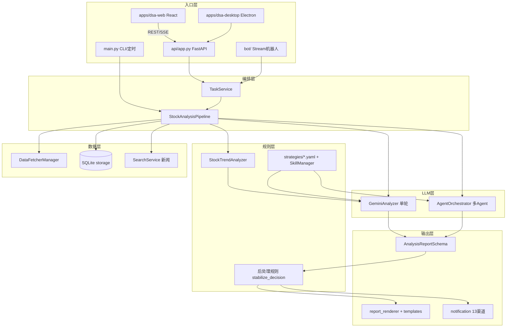
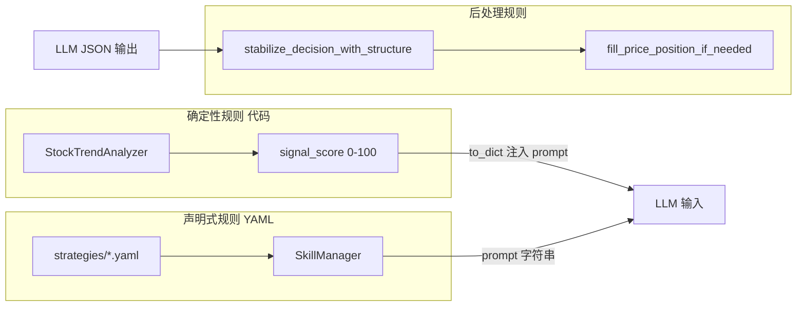
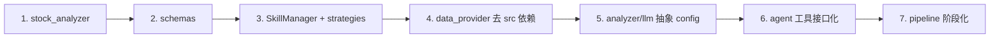

# daily_stock_analysis 项目模块拆分分析报告

> 分析对象：[ZhuLinsen/daily_stock_analysis](https://github.com/ZhuLinsen/daily_stock_analysis)  
> 本地路径：`daily_stock_analysis/`  
> 分析维度：数据层、规则层、LLM 层、UI 层及模块独立复用可行性

---

## 1. 项目定位与总体架构

daily_stock_analysis 是一个 **Python 单体应用**，主流程为：

> 抓取数据 → 技术分析/新闻检索 → LLM 分析 → 生成报告 → 通知推送

四层理解**基本正确**，但项目实际还有 **编排层（Pipeline）**、**持久化层（SQLite）**、**通知层** 和 **Bot/API 接入层** 作为横切关注点。核心编排集中在 `src/core/pipeline.py`（约 2900 行），是各层粘合的「上帝对象」。



---

## 2. 四层拆解详情

### 2.1 数据层（Data Layer）

**目录边界**

| 路径 | 职责 |
|------|------|
| `data_provider/` | 多源行情/基本面适配，核心抽象 `BaseFetcher` + `DataFetcherManager` |
| `src/storage.py` | SQLite ORM，`DatabaseManager` |
| `src/repositories/` | 日线/分析/持仓/告警等 DB 访问封装 |
| `src/services/history_loader.py` | DB 优先、网络回退的 K 线加载 |
| `src/services/stock_service.py` | API 层行情封装 |
| `src/search_service.py` | 新闻/舆情搜索（Tavily/SerpAPI/Anspire 等） |

**核心抽象**

- `BaseFetcher`：模板方法 `get_daily_data()` → 拉取 → 标准化 → MA/量比计算
- `DataFetcherManager`：按市场（A/港/美）和 priority 做 **failover**；实时行情有熔断器（`data_provider/realtime_types.py`）
- 数据源：efinance → akshare → tushare → pytdx → baostock → yfinance → longbridge（见 `requirements.txt`）

**独立使用可行性：6/10**

- **可直接用**：注入自定义 Fetcher 后调用 `DataFetcherManager.get_daily_data()` / `get_realtime_quote()`
- **阻碍因素**：
  - `data_provider/base.py` 顶层 import 了 `src.config`、`src.services.run_diagnostics`、`src.data.stock_index_loader`
  - 默认初始化强依赖 `.env` 配置（Tushare token、Longbridge 凭据等）
  - 非 pip 独立包，需整个 repo 在 PYTHONPATH 中

**最小独立用法（无需 LLM/UI）**

```python
from src.config import setup_env
setup_env()
from data_provider import DataFetcherManager

mgr = DataFetcherManager()
df, source = mgr.get_daily_data("600519", days=30)
quote = mgr.get_realtime_quote("600519")
```

---

### 2.2 规则层（Rules Layer）

项目中「规则」实际分 **三层**，耦合程度不同：



**目录边界**

| 路径 | 类型 | 职责 |
|------|------|------|
| `src/stock_analyzer.py` | **确定性** | MA/MACD/RSI/量能 → `TrendAnalysisResult`（含 `signal_score`、`buy_signal`） |
| `strategies/*.yaml`（15 个） | **声明式** | 交易技能/策略，注入 LLM system prompt，**不执行代码** |
| `src/agent/skills/` | 技能运行时 | `SkillManager`、`SkillRouter`、`SkillAggregator` |
| `src/core/market_strategy.py` | 市场复盘 | 独立于个股策略的 CN/HK/US 复盘蓝图 |
| `src/core/backtest_engine.py` | 回测 | 基于历史数据的策略验证 |

**确定性评分逻辑**（`src/stock_analyzer.py`）：

- 100 分加权：趋势 30 + 乖离 20 + 量能 15 + 支撑 10 + MACD 15 + RSI 10
- 仅依赖 pandas/numpy + `Config.bias_threshold`

**YAML 策略示例**（`strategies/bull_trend.yaml`）：

- `instructions` + `core_rules: [1,2,3]` + `required_tools: [get_daily_history, analyze_trend]`
- YAML 中的「sentiment_score +10」是 **给 LLM 的评分指引**，非程序加减分

**独立使用可行性**

| 子模块 | 分数 | 说明 |
|--------|------|------|
| `StockTrendAnalyzer` | **9/10** | 几乎零耦合，输入 DataFrame 即可 |
| `strategies/` + `SkillManager` | **8/10** | 只输出 prompt 字符串，不调用模型 |
| 后处理规则 | **7/10** | 依赖 `AnalysisResult` 结构 |
| 回测引擎 | **6/10** | 依赖 DB + 历史数据 |

**可独立抽取为**：`stock-rules-engine` 包，`analyze(df, code) -> TrendAnalysisResult`

---

### 2.3 LLM 模型层（LLM Layer）

**目录边界**

| 路径 | 职责 |
|------|------|
| `src/analyzer.py` | `GeminiAnalyzer`：单轮 JSON 报告（默认路径） |
| `src/llm/` | LiteLLM 参数、错误恢复 |
| `src/agent/` | 多 Agent 编排（Technical → Intel → Risk → Skill → Decision） |
| `src/schemas/report_schema.py` | LLM JSON 输出契约（Pydantic） |
| `src/schemas/analysis_context_pack.py` | 版本化分析输入信封 |
| `src/services/analysis_context_builder.py` | Pipeline 数据 → Pack |
| `src/services/report_renderer.py` + `templates/` | Jinja2 报告渲染 |

**双轨分析路径**（`src/core/pipeline.py` L266+）

| 路径 | 触发条件 | 流程 |
|------|----------|------|
| **单轮 LLM（默认）** | `agent_mode=false` 且无 `agent_skills` | 新闻搜索 → `AnalysisContextPack` → `GeminiAnalyzer.analyze()` → Schema 校验 |
| **Agent 模式** | `agent_mode=true` 或配置了 `agent_skills` | 多 Agent + Tool Calling（`analyze_trend` 等）→ `DecisionAgent` dashboard |

**LLM 依赖**：LiteLLM 统一路由（Gemini/OpenAI/DeepSeek/Claude/Ollama 等），配置在 `.env` / `SystemConfigService`

**独立使用可行性**

| 子模块 | 分数 | 说明 |
|--------|------|------|
| `schemas/` | **9/10** | 纯 Pydantic，可单独发布 |
| `GeminiAnalyzer` + `llm/` | **6/10** | 强依赖 config、SkillManager、storage 用量统计 |
| `src/agent/` 全套 | **5/10** | tools 反向依赖 data_provider、DB、search |
| `report_renderer` + templates | **7/10** | 输入 `AnalysisResult` 即可渲染 |

**数据流**：`TrendAnalysisResult` → context/Pack → prompt（+ skill instructions）→ LLM JSON → `AnalysisReportSchema` → `AnalysisResult` → 后处理 → 报告/推送

---

### 2.4 UI 层（UI Layer）

**目录边界**

| 路径 | 技术栈 | 职责 |
|------|--------|------|
| `apps/dsa-web/` | React + Vite + Zustand | Web 工作台：分析、历史、持仓、回测、告警、配置 |
| `apps/dsa-desktop/` | Electron | 桌面壳：spawn 后端 + 加载 Web UI |
| `api/` | FastAPI | REST + SSE，薄路由层 |
| `static/` | 构建产物 | 生产模式 SPA 托管 |
| `bot/` | Stream 长连接 | 钉钉/飞书 IM 机器人（非 REST） |
| `src/notification*` | 13 渠道 sender | 企业微信/飞书/Telegram/邮件等推送 |

**入口关系**

- `main.py`：CLI 分析 + 可选后台 API + Bot Stream
- `webui.py` / `server.py`：仅启动 FastAPI
- 桌面端：spawn `main.py --serve-only`，禁用定时/Bot

**前后端连接**

- 开发：Vite `:5173` → proxy `/api` → FastAPI `:8000`
- 生产：FastAPI 托管 `static/`，同源 REST + SSE（`/api/v1/analysis/tasks/stream`）
- 前端仅依赖 HTTP 契约，设 `VITE_API_URL` 可对接远程后端

**独立使用可行性**

| 子模块 | 分数 | 说明 |
|--------|------|------|
| `dsa-web` | **8/10** | 纯前端，需完整 `/api/v1` 契约 + `stocks.index.json` |
| `dsa-desktop` | **7/10** | 仅依赖 `/api/health` + 静态 UI |
| `api/` FastAPI | **4/10** | 路由薄但 endpoint 深度绑定 `src/` 全栈 |
| `bot/` | **5/10** | 共用 TaskService/Agent，Webhook 路由未挂到 FastAPI |

---

## 3. 模块耦合矩阵

| 模块 | 可独立运行 | 主要依赖 | 被谁依赖 |
|------|-----------|----------|----------|
| `data_provider` | 部分 | config, diagnostics | pipeline, agent tools, API |
| `stock_analyzer` | 是 | pandas, config.bias | pipeline, agent tools |
| `strategies/` + SkillManager | 是 | PyYAML | analyzer, agent |
| `schemas/` | 是 | pydantic | analyzer, API, renderer |
| `GeminiAnalyzer` | 部分 | litellm, config, skills | pipeline |
| `agent/` | 否 | data, search, DB, config | pipeline, bot, API |
| `pipeline` | 否 | 全部 | CLI, TaskService |
| `dsa-web` | 是（需 API） | HTTP 契约 | 无 |
| `notification` | 部分 | config, 外部 webhook | pipeline, bot, alerts |

**关键结论**：项目不是微服务架构，而是 **以 Pipeline 为中心的 Python 单体**。API/Bot/CLI 都是不同入口，共享同一套 `src/services` + `src/core`。

---

## 4. 你能否把各模块拆开来用？

### 4.1 可以直接拆用（低改造成本）

1. **技术分析规则引擎** — `StockTrendAnalyzer`
   - 输入：OHLCV DataFrame
   - 输出：`TrendAnalysisResult`（signal_score、buy_signal、MA 状态等）
   - 适合嵌入你自己的选股/告警系统

2. **YAML 策略库** — `strategies/` + `SkillManager`
   - 只生成 prompt 片段，可接入任意 LLM 框架
   - 15 种内置策略（均线、缠论、波浪、龙头、缩量回踩等）

3. **Schema 契约** — `src/schemas/`
   - 可复用其 JSON 报告结构定义

4. **Web 前端** — `apps/dsa-web`
   - 对接任意实现了 `/api/v1/*` 的后端即可

5. **行情数据** — `DataFetcherManager`（注入 Fetcher 模式）
   - 适合作为多源行情 SDK 使用

### 4.2 可拆但需改造（中等成本）

1. **LLM 分析器** — 需抽象 `config`、去掉 `storage.persist_llm_usage` 硬依赖
2. **报告渲染** — 需携带 `templates/` 和 `AnalysisResult` 类型
3. **通知层** — 13 个 sender 相对独立，但路由/降噪逻辑绑 config
4. **新闻搜索** — `SearchService` 可单独用，但依赖多个 API Key

### 4.3 不建议单独拆（高耦合）

1. **`StockAnalysisPipeline`** — 上帝对象，拆它等于重写架构
2. **`src/agent/` 全套** — tools 与 data/DB/search 深度绑定
3. **`api/` 层** — 无业务逻辑，脱离 `src/` 无意义

---

## 5. 推荐拆分路径（若要做模块化复用）

按 **投入产出比** 排序：



| 阶段 | 产出 | 预估工作量 |
|------|------|-----------|
| Phase 1 | `stock-rules-engine` pip 包 | 小 |
| Phase 2 | `dsa-schemas` 共享契约包 | 小 |
| Phase 3 | `dsa-skills` 策略 prompt 包 | 小 |
| Phase 4 | `dsa-data` 行情 SDK（去掉 config 硬依赖） | 中 |
| Phase 5 | `dsa-llm` 分析器（回调式 config/usage） | 中 |
| Phase 6 | Agent 工具 plugin 接口 | 大 |
| Phase 7 | Pipeline → FetchStage/RuleStage/LLMStage/NotifyStage | 大 |

---

## 6. 典型使用场景对照

| 你的目标 | 推荐组合 | 是否需要全量项目 |
|----------|----------|-----------------|
| 只要多源行情数据 | `data_provider` + `.env` | 否 |
| 只要技术指标评分 | `stock_analyzer` + pandas | 否 |
| 用自己的 LLM 做分析报告 | `stock_analyzer` + `strategies/` + 自写 prompt | 否 |
| 完整 AI 决策仪表盘 | 全栈或 `main.py --serve-only` + Web UI | 是 |
| 定时推送到微信/飞书 | CLI + pipeline + notification | 是（可用 GitHub Actions 零服务器） |
| IM 机器人问股 | bot Stream + 后端服务 | 是 |
| 嵌入现有系统 | API 模式 + 只调 `/api/v1/analysis` | 后端需完整部署 |

---

## 7. 架构特点与风险

**优势**

- 数据层抽象清晰（`BaseFetcher` + failover）
- 规则分确定性/声明式两层，边界相对明确
- Schema 契约完善，LLM 输出可校验
- UI 与后端通过 REST/SSE 解耦，前端可独立开发

**风险/缺口**

- `pipeline.py` 单文件过大，是拆分最大障碍
- `data_provider` 名义独立、实际 import `src.*`
- Bot Webhook 路由未挂到 FastAPI（生产靠 Stream 长连接）
- 前端类型与 API schema 手工对齐，无自动生成 OpenAPI client
- 无独立 pip 包发布，所有模块共享 monorepo 依赖树

---

## 8. 总结

四层模型与项目实际结构 **高度吻合**，但需补充：

- **编排层**（Pipeline/TaskService）是隐式第五层，各模块通过它粘合
- **规则层** 不是单一模块，而是「代码评分 + YAML prompt + 后处理」三层
- **LLM 层** 有单轮/Agent 双轨，Agent 模式与数据层耦合更深

**能否拆开用？** — **部分可以，整体不行**：

- 最易复用：`StockTrendAnalyzer`（9/10）、`schemas`（9/10）、`strategies`（8/10）、`dsa-web`（8/10）
- 中等难度：`data_provider`（6/10）、`GeminiAnalyzer`（6/10）
- 不建议单独拆：`pipeline`（4/10）、`agent` 全套（5/10）

若目标是构建自己的 stock_copilot 系统，建议 **以 API 模式运行完整后端，按需调用 REST 接口**，或 **优先抽取 stock_analyzer + data_provider 作为 Python 库**，而非 fork 整个 monorepo 做物理拆分。
