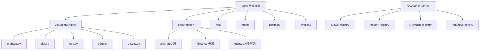

# valueinvest 模块结构分析报告

> 项目：[wangzhe3224/valueinvest](https://github.com/wangzhe3224/valueinvest)  
> 本地路径：`valueinvest/`  
> 版本：1.3.2（`pyproject.toml`）  
> 定位：以 `Stock` 为中心、Registry 扩展多市场数据、以 `ValuationEngine` 编排 20+ 估值方法的**自包含价值投资分析库**

---

## 1. 顶层目录树

```
valueinvest/
├── pyproject.toml              # Hatchling 构建、可选依赖分组
├── README.md                   # 主文档与 Quick Start
├── AGENTS.md                   # AI Agent 任务模板
├── valueinvest/                # 主包（~116 个 .py）
├── scripts/                    # 命令行分析脚本（15 个）
├── examples/                   # 示例与演示
├── tests/                      # pytest
└── docs/quick_reference.md
```

---

## 2. 架构模式



**设计模式：**

- **Registry 模式**：新闻/内部人/回购/行业等按 ticker 自动路由 A 股/美股 fetcher
- **Strategy 模式**：估值方法继承 `BaseValuation`，引擎按 key 注册
- **可选依赖**：核心 `dependencies = []`，数据源通过 `[us]` / `[ashare]` / `[fetch]` extra 安装

---

## 3. 主包结构

```
valueinvest/
├── __init__.py                 # 公共 API 导出
├── stock.py                    # Stock / StockHistory 核心数据模型
├── exceptions.py
├── data/
│   ├── fetcher/                # yfinance / akshare / tushare
│   ├── presets.py              # Mock 预设数据
│   └── freshness.py            # 数据新鲜度检查
├── valuation/                  # 估值引擎与方法（20+）
├── screener/                   # 多因子选股
├── cyclical/                   # 周期股专项
├── news/                       # 新闻与情绪
├── insider/                    # 内部人交易
├── buyback/                    # 回购
├── cashflow/                   # 现金流质量
├── industry/                 # 行业/同业
├── peer_comparison/            # 同业对比
├── implied_growth/             # 隐含增长率
├── roic/                       # ROIC / WACC / 经济利润
├── moat/                       # 护城河
├── capital/                    # 资本配置质量
├── redflags/                   # 会计红旗
└── reports/                    # 文本报告格式化
```

---

## 4. 核心类与职责

### 4.1 数据模型

| 类 | 文件 | 职责 |
|----|------|------|
| `Stock` | `stock.py` | 财务数据容器；`from_api()`、`fetch_price_history()` |
| `StockHistory` | `stock.py` | K 线、CAGR、波动率、最大回撤 |
| `ValuationEngine` | `valuation/engine.py` | 注册并运行全部估值法 |
| `ValuationResult` | `valuation/base.py` | 统一输出（fair_value、margin_of_safety、confidence） |

### 4.2 数据抓取路由（`data/fetcher/__init__.py`）

| 数据源 | 安装 extra | 市场 |
|--------|-----------|------|
| AKShare | `[ashare]` / `[fetch]` | A 股 6 位代码 |
| yfinance | `[us]` / `[fetch]` | 美股及国际 |
| Tushare | `[tushare]` | A 股（需 `TUSHARE_TOKEN`） |

路由逻辑：纯 6 位数字 → akshare；`600000.SH` → tushare（有 token）或 akshare；其他 → yfinance。

### 4.3 扩展分析引擎

| 引擎 | 路径 | 职责 |
|------|------|------|
| `CyclicalAnalysisEngine` | `cyclical/engine.py` | 周期位置评分 + 周期估值 |
| `EconomicProfitEngine` | `roic/engine.py` | ROIC vs WACC、经济利润 |
| `MoatAnalysisEngine` | `moat/engine.py` | 护城河信号合成 |
| `CapitalAllocationEngine` | `capital/engine.py` | 12 项资本配置信号 |
| `AccountingRedFlagsEngine` | `redflags/engine.py` | 11 项会计红旗 |
| `ImpliedGrowthEngine` | `implied_growth/engine.py` | 从市价反推隐含增长率 |
| `PeerComparisonEngine` | `peer_comparison/engine.py` | 同业指标对比 |
| `ScreeningPipeline` | `screener/pipeline.py` | 并发拉数 + 过滤 + 打分 |

---

## 5. 估值方法清单

`ValuationEngine` 在 `valuation/engine.py` 中注册 **24 个 method key**：

### 5.1 绝对/内在价值

| method key | 类 | 文件 | 说明 |
|------------|-----|------|------|
| `graham_number` | `GrahamNumber` | `graham.py` | √(22.5×EPS×BVPS) |
| `graham_formula` | `GrahamFormula` | `graham.py` | 成长调整 Graham 公式 |
| `ncav` | `NCAV` | `graham.py` | 净流动资产价值 |
| `dcf` | `DCF` | `dcf.py` | 10 年 FCF 折现 |
| `reverse_dcf` | `ReverseDCF` | `dcf.py` | 反推隐含增长率 |
| `epv` | `EPV` | `epv.py` | 零增长盈利力价值 |
| `owner_earnings` | `OwnerEarnings` | `quality.py` | Buffett 所有者收益 |
| `magic_formula` | `MagicFormula` | `magic_formula.py` | Greenblatt 神奇公式 |

### 5.2 股息模型

| method key | 类 | 文件 |
|------------|-----|------|
| `ddm` | `DDM` | `ddm.py` |
| `two_stage_ddm` | `TwoStageDDM` | `ddm.py` |

### 5.3 成长/相对估值

| method key | 类 | 文件 |
|------------|-----|------|
| `peg` | `PEG` | `growth.py` |
| `garp` | `GARP` | `growth.py` |
| `rule_of_40` | `RuleOf40` | `growth.py` |
| `ev_ebitda` | `EVEBITDA` | `growth.py` |
| `pe_relative` | `PERelativeValuation` | `relative.py` |
| `pb_relative` | `PBRelativeValuation` | `relative.py` |

### 5.4 银行专用

| method key | 类 | 文件 |
|------------|-----|------|
| `pb` | `PBValuation` | `bank.py` |
| `residual_income` | `ResidualIncome` | `bank.py` |

### 5.5 质量/风险评分

| method key | 类 | 文件 |
|------------|-----|------|
| `altman_z` | `AltmanZScore` | `quality.py` |
| `piotroski_f` | `PiotroskiFScore` | `quality.py` |
| `beneish_m` | `BeneishMScore` | `mscore.py` |
| `value_trap` | `ValueTrapDetector` | `value_trap.py` |
| `sbc_analysis` | `SBCAnalysis` | `sbc.py` |

### 5.6 周期股（需 `CyclicalStock`）

| method key | 类 | 文件 |
|------------|-----|------|
| `cyclical_pb` | `CyclicalPBValuation` | `cyclical/valuation/cyclical_pb.py` |
| `cyclical_pe` | `CyclicalPEValuation` | `cyclical/valuation/cyclical_pe.py` |
| `cyclical_fcf` | `CyclicalFCFValuation` | `cyclical/valuation/cyclical_fcf.py` |
| `cyclical_dividend` | `CyclicalDividendValuation` | `cyclical/valuation/cyclical_dividend.py` |

### 5.7 引擎预设组合

- `DEFAULT_METHODS`：默认 22 项
- `BANK_METHODS` / `DIVIDEND_METHODS` / `GROWTH_METHODS` / `VALUE_METHODS` / `CYCLICAL_METHODS`
- `get_recommended_methods()`：按银行/股息/成长/价值自动推荐

---

## 6. 入口点与使用方式

**无 REST API**，使用方式为 Python 库 import 或直接运行 scripts。

### 6.1 库 API（推荐）

```python
from valueinvest import Stock, ValuationEngine

stock = Stock.from_api("600887")   # 或 "AAPL"
engine = ValuationEngine()
results = engine.run_all(stock)
summary = engine.summary(results)
```

### 6.2 主要 CLI 脚本

| 脚本 | 用途 |
|------|------|
| `scripts/stock_analyzer.py` | 全维度分析：估值 + 可选 news/insider/buyback/cyclical/peers |
| `scripts/analyze.py` | 使用 `data/presets.py` 离线数据 |
| `python -m valueinvest.screener.cli` | 选股 CLI |

### 6.3 公共导出（`valueinvest/__init__.py`）

`Stock`, `ValuationEngine`, `NewsRegistry`, `InsiderRegistry`, `BuybackRegistry`, `CyclicalAnalysisEngine`, `MoatAnalysisEngine`, `EconomicProfitEngine`, `CapitalAllocationEngine`, `PeerComparisonEngine`, `ImpliedGrowthEngine`, `AccountingRedFlagsEngine` 等。

---

## 7. 独立使用可行性

| 模块 | 分数 | 说明 |
|------|------|------|
| `valuation/*` | **9/10** | 仅需 `Stock` dataclass，可无网络离线运行 |
| `data/fetcher/*` | **8/10** | 三源 lazy import，A 股/美股自动路由 |
| `roic/`, `moat/`, `capital/`, `redflags/` | **9/10** | 纯 `Stock` 计算 |
| `implied_growth/` | **9/10** | 纯 `Stock` + 内部 analyzer |
| `cyclical/` | **7/10** | 独立 `CyclicalStock`，与 ValuationEngine 有交叉 |
| `screener/` | **7/10** | 依赖 `Stock.from_api` + `ValuationEngine` |
| `news/`（LLM/Agent） | **6/10** | keyword 分析独立；LLM 需外部 API |
| `peer_comparison/` | **7/10** | 依赖 `IndustryRegistry` 拉同业数据 |

---

## 8. 与 stock_copilot 的关系

| 优势 | 局限 |
|------|------|
| 24 种估值方法，经典价值投资模型齐全 | 星数/community 较小 |
| A 股 + 美股原生支持（akshare/yfinance） | 无 Web/API 层 |
| `Stock` + `ValuationEngine` 接口简洁 | 与 daily_stock_analysis 无代码耦合 |
| 护城河/ROIC/会计红旗等深度分析 | 新闻 LLM 分析与 DSA 重复 |
| 独立 pip 包，核心零硬依赖 | `Market` 枚举在 `news/base.py`，多 Registry 共享 |

**适合在 stock_copilot 中扮演的角色**：**价值投资决策引擎** — 负责内在价值估算、安全边际、质量评分、价值面买卖建议。

---

## 9. 关键文件速查

| 类别 | 路径 |
|------|------|
| 公共 API | `valueinvest/__init__.py` |
| 数据模型 | `valueinvest/stock.py` |
| 估值引擎 | `valueinvest/valuation/engine.py` |
| Graham/DCF/EPV | `valueinvest/valuation/graham.py`, `dcf.py`, `epv.py` |
| 数据源路由 | `valueinvest/data/fetcher/__init__.py` |
| 主 CLI | `scripts/stock_analyzer.py` |
| 选股 CLI | `valueinvest/screener/cli.py` |
| 构建配置 | `pyproject.toml` |
