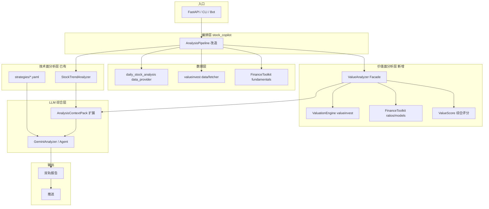

# stock_copilot 价值面分析层接入方案

> 目标：在 stock_copilot 中新增「价值面分析层」，与 daily_stock_analysis 现有的「技术面分析层」并行，最终形成 **技术面 + 价值面 + LLM 综合决策** 的双轨架构。  
> 参考项目：`daily_stock_analysis/`、`FinanceToolkit/`、`valueinvest/`  
> 关联文档：[daily_stock_analysis 模块分析](references/daily_stock_analysis-module-analysis.md)

---

## 1. 背景与目标

### 1.1 现状

daily_stock_analysis 当前是 **技术面主导** 的分析系统：

| 已有能力 | 所在模块 | 性质 |
|----------|----------|------|
| MA/MACD/RSI/量能评分 | `src/stock_analyzer.py` | 确定性技术面 |
| YAML 交易策略 | `strategies/*.yaml` | 声明式 prompt 规则 |
| 基础基本面快照 | `data_provider/fundamental_adapter.py` | PE/PB/ROE 等原始字段 |
| LLM 综合报告 | `src/analyzer.py` + `src/agent/` | 概率性决策 |

**缺失**：内在价值估算、安全边际、DCF/Graham/EPV 等经典价值投资模型、财务质量评分体系、价值面独立买卖信号。

### 1.2 目标架构



---

## 2. 两个库的选型分工

FinanceToolkit 和 valueinvest **不是二选一**，而是互补：

| 维度 | FinanceToolkit | valueinvest | 推荐用法 |
|------|----------------|-------------|----------|
| 定位 | 透明财务指标计算平台 | 价值投资决策引擎 | FT 算指标，VI 做估值 |
| A 股支持 | 弱（主要 FMP/YF 美股） | 强（akshare/tushare） | A 股优先 valueinvest |
| 美股支持 | 强（FMP 150+ 指标） | 强（yfinance） | 美股两者均可 |
| DCF/WACC | 有（5 期 FCF） | 有（10 年 FCF + Reverse DCF） | 以 valueinvest 为主 |
| Graham/EPV/NCAV | 无 | 有 | valueinvest 独占 |
| 150+ 财务比率 | 有（透明公式） | 部分（内嵌在 Stock 字段） | FinanceToolkit 补充 |
| Altman/Piotroski | 有 | 有 | 优先 valueinvest（已集成在引擎） |
| 护城河/ROIC/红旗 | 无 | 有 | valueinvest 独占 |
| 周期股 | 无 | 有 | valueinvest 独占 |
| 同业对比 | 无 | 有 | valueinvest 独占 |
| 社区/成熟度 | 高（~4.6k stars） | 低（~几十 stars） | FT 作公式参考/校验 |

**结论**：

- **valueinvest** → 价值面分析层的 **主引擎**（估值 + 质量 + 护城河 + 安全边际）
- **FinanceToolkit** → 价值面分析层的 **指标补充层**（透明 ROE/ROIC/PE/PB/FCF 比率，尤其美股深度分析）

---

## 3. 推荐接入架构

### 3.1 新增模块：`ValueAnalyzer`

建议在 stock_copilot 中新建独立包（不直接改 daily_stock_analysis 源码），例如：

```
stock_copilot/
├── daily_stock_analysis/       # 现有：技术面 + LLM + UI（尽量不侵入）
├── valueinvest/                # 克隆：价值投资引擎
├── FinanceToolkit/             # 克隆：财务指标库
└── stock_value/                # 新增：价值面分析层
    ├── __init__.py
    ├── analyzer.py             # ValueAnalyzer Facade
    ├── adapters/
    │   ├── valueinvest_adapter.py
    │   └── financetoolkit_adapter.py
    ├── models/
    │   ├── value_result.py     # ValueAnalysisResult
    │   └── value_score.py      # 综合价值评分
    ├── mappers/
    │   └── ticker_mapper.py    # DSA code ↔ valueinvest/FT ticker
    └── prompts/
        └── value_context_prompt.py
```

### 3.2 核心数据契约

```python
@dataclass
class ValueAnalysisResult:
    code: str
    stock_name: str
    market: str                          # cn / us / hk

    # 估值结果
    fair_values: Dict[str, float]        # method -> fair_value
    margin_of_safety: Dict[str, float]   # method -> mos%
    recommended_methods: List[str]

    # 质量评分
    quality_score: int                   # 0-100
    piotroski_f: Optional[int]
    altman_z: Optional[float]
    beneish_m: Optional[float]

    # 深度分析
    roic_vs_wacc: Optional[str]          # 创造/毁灭价值
    moat_rating: Optional[str]
    red_flags: List[str]
    implied_growth: Optional[float]

    # 综合结论
    value_signal: str                    # 严重低估/低估/合理/高估/严重高估
    value_score: int                     # 0-100
    value_reasons: List[str]

    # 原始上下文（供 LLM）
    raw_context: Dict[str, Any]
```

### 3.3 ValueAnalyzer Facade 伪代码

```python
class ValueAnalyzer:
    def __init__(self, fmp_api_key: Optional[str] = None):
        self._vi_engine = ValuationEngine()
        self._fmp_key = fmp_api_key

    def analyze(self, code: str) -> ValueAnalysisResult:
        ticker = map_to_valueinvest_ticker(code)
        stock = Stock.from_api(ticker)

        # 1. valueinvest 主引擎
        valuations = self._vi_engine.run_recommended(stock)
        moat = MoatAnalysisEngine().analyze(stock)
        roic = EconomicProfitEngine().analyze(stock)
        redflags = AccountingRedFlagsEngine().analyze(stock)
        implied = ImpliedGrowthEngine().analyze(stock)

        # 2. FinanceToolkit 补充（美股或有 FMP Key 时）
        ft_ratios = self._fetch_ft_ratios(code) if self._should_use_ft(code) else {}

        # 3. 综合评分
        return self._build_result(code, stock, valuations, moat, roic, redflags, implied, ft_ratios)
```

---

## 4. 与 daily_stock_analysis 的集成点

### 4.1 Pipeline 集成（推荐 Phase 2）

在 `StockAnalysisPipeline.analyze_stock()` 中，于 `StockTrendAnalyzer.analyze()` 之后、LLM 分析之前，插入价值面分析：

```
现有流程：
  行情 → 筹码 → fundamental_context(原始) → StockTrendAnalyzer → LLM

改造后：
  行情 → 筹码 → fundamental_context(原始)
       → StockTrendAnalyzer          ← 技术面
       → ValueAnalyzer.analyze()     ← 价值面（新增）
       → 合并 context → LLM
```

**具体挂载位置**：`src/core/pipeline.py` L369 附近（`fundamental_context` 获取之后、趋势分析之前或并行）。

### 4.2 AnalysisContextPack 扩展（推荐 Phase 2）

在 `src/schemas/analysis_context_pack.py` 中新增 block：

```python
class ValueAnalysisBlock(_AnalysisContextModel):
    value_score: Optional[int]
    value_signal: Optional[str]
    fair_value_median: Optional[float]
    margin_of_safety: Optional[float]
    quality_score: Optional[int]
    piotroski_f: Optional[int]
    moat_rating: Optional[str]
    red_flags: List[str] = []
    status: ContextFieldStatus
```

LLM prompt 中增加价值面摘要段，让模型同时看到：

- 技术面：`signal_score=72, 多头排列, 缩量回踩`
- 价值面：`value_score=65, 低估, DCF fair_value=180, 当前价=150, MOS=16.7%`

### 4.3 报告 Schema 扩展（推荐 Phase 3）

在 `src/schemas/report_schema.py` 的 dashboard 中新增字段：

```json
{
  "value_analysis": {
    "value_score": 65,
    "value_signal": "低估",
    "fair_value_range": [170, 195],
    "margin_of_safety": 16.7,
    "quality_grade": "B+",
    "key_strengths": ["ROIC > WACC", "Piotroski F=7"],
    "key_risks": ["Beneish M-Score 偏高"]
  }
}
```

### 4.4 API 扩展（推荐 Phase 3）

新增独立端点，允许单独调用价值面分析：

```
POST /api/v1/analysis/value
GET  /api/v1/stocks/{code}/valuation
```

### 4.5 集成方式对比

| 方式 | 侵入性 | 推荐阶段 | 说明 |
|------|--------|----------|------|
| **A. 独立 Python 包 + Pipeline 调用** | 低 | Phase 1-2 | 新建 `stock_value/`，pipeline import 调用 |
| **B. 独立微服务** | 高 | 不推荐初期 | 过度工程 |
| **C. Fork daily_stock_analysis 改源码** | 高 | 不推荐 | 难同步上游 |
| **D. 仅 CLI/脚本层组合** | 最低 | Phase 0 | 快速验证，不改 DSA |

**推荐路径**：Phase 0 脚本验证 → Phase 1 独立包 → Phase 2 Pipeline 集成 → Phase 3 API/报告/UI。

---

## 5. 分阶段实施计划

### Phase 0：快速验证（1-2 天）

**目标**：不改 daily_stock_analysis，用脚本验证两个库对同一股票的分析效果。

```bash
# 安装
cd valueinvest && pip install -e ".[fetch]"
cd ../FinanceToolkit && pip install -e .

# 验证
python scripts/compare_analysis.py 600519   # 茅台 A 股
python scripts/compare_analysis.py AAPL     # 苹果 美股
```

输出对比表：valueinvest 估值结果 vs FinanceToolkit 比率 vs DSA 现有 fundamental_context。

### Phase 1：独立价值面分析包（3-5 天）

**目标**：新建 `stock_value/`，封装 ValueAnalyzer，可独立调用。

| 任务 | 产出 |
|------|------|
| ticker 映射 | A 股 600519 ↔ valueinvest akshare；美股 AAPL ↔ yfinance |
| valueinvest_adapter | 调用 ValuationEngine + Moat + ROIC + RedFlags |
| financetoolkit_adapter | 美股补充 150+ 比率（可选 FMP Key） |
| ValueAnalysisResult | 统一输出契约 |
| value_score 算法 | 加权：估值 40 + 质量 30 + 护城河 20 + 风险 10 |
| 单元测试 | mock Stock 数据，验证评分逻辑 |

### Phase 2：Pipeline 集成（3-5 天）

**目标**：daily_stock_analysis 分析流程中并行产出价值面结论。

| 任务 | 产出 |
|------|------|
| Pipeline 挂载点 | `pipeline.py` 中调用 ValueAnalyzer |
| ContextPack 扩展 | 新增 `ValueAnalysisBlock` |
| Prompt 注入 | `analysis_context_pack_prompt.py` 增加价值面段 |
| 后处理规则 | 价值面与技术面冲突时的 decision 校准 |
| 配置项 | `.env` 新增 `VALUE_ANALYSIS_ENABLED`, `FMP_API_KEY` |

**双轨决策逻辑示例**：

| 技术面 | 价值面 | 综合建议 |
|--------|--------|----------|
| 买入信号 + 多头排列 | 低估 + MOS>15% | 强烈关注，技术面与价值面共振 |
| 买入信号 | 高估 | 短中线可博弈，但不适合长期持有 |
| 观望 | 严重低估 | 价值投资者可分批建仓，等待技术面改善 |
| 卖出信号 | 低估 | 可能是错杀，关注基本面是否恶化 |
| 买入信号 | 价值陷阱（M-Score 高） | 回避，表面便宜但财务质量差 |

### Phase 3：报告 / API / UI（5-7 天）

| 任务 | 产出 |
|------|------|
| report_schema 扩展 | dashboard 增加 value_analysis 区块 |
| report_renderer | Jinja2 模板增加价值面段落 |
| API 端点 | `/api/v1/analysis/value` |
| Web UI | 分析报告页展示价值面卡片 |
| 推送模板 | 微信/飞书增加价值面摘要 |

---

## 6. 关键技术决策

### 6.1 A 股数据源策略

| 数据 | 来源 | 原因 |
|------|------|------|
| 财务三表 + 估值 | valueinvest (akshare) | A 股原生支持 |
| 补充比率 | 不使用 FinanceToolkit | FMP 对 A 股覆盖差 |
| 行情/K 线 | daily_stock_analysis data_provider | 已有 failover 链 |
| 新闻/舆情 | daily_stock_analysis SearchService | 已有 |

### 6.2 美股数据源策略

| 数据 | 来源 | 原因 |
|------|------|------|
| 估值 | valueinvest (yfinance) | 简洁 |
| 150+ 财务比率 | FinanceToolkit (FMP/YF) | 公式透明、指标全 |
| WACC/DCF 交叉验证 | 两者都算，取中位数或加权 | 互相校验 |

### 6.3 港股

- valueinvest 默认不支持港股（可扩展 Registry）
- daily_stock_analysis 已有 longbridge/yfinance 港股权重
- **Phase 1 暂不支持港股价值面**，Phase 2+ 通过 yfinance 或 longbridge 基本面适配

### 6.4 依赖管理

```toml
# stock_value/pyproject.toml
[project]
dependencies = []

[project.optional-dependencies]
value = ["valueinvest[fetch]"]
metrics = ["financetoolkit"]
full = ["valueinvest[fetch]", "financetoolkit"]
```

不把 FinanceToolkit / valueinvest 直接 merge 进 daily_stock_analysis 的 `requirements.txt`，而是通过 `stock_value` 包按需引入。

---

## 7. 风险与应对

| 风险 | 影响 | 应对 |
|------|------|------|
| valueinvest 社区小、维护不确定 | 引擎 bug 无人修 | 核心 valuation 逻辑写测试锁定；必要时 fork |
| 两套 DCF 算法结果差异大 | LLM/用户困惑 | 输出「估值区间」而非单点；标注方法论 |
| A 股财务数据质量 | 估值失真 | freshness 检查 + 数据 coverage 标注 |
| Pipeline 改造影响现有功能 | 回归 bug | 价值面默认 `VALUE_ANALYSIS_ENABLED=false`；充分测试 |
| 分析耗时增加 | 用户体验下降 | 价值面分析异步/缓存（SQLite 存 valuation snapshot） |
| LLM token 增加 | 成本上升 | ValueAnalysisBlock 只注入摘要，非全量 raw |

---

## 8. 与现有模块的对应关系

| stock_copilot 目标层 | 现有（DSA） | 新增（Value） | 来源库 |
|---------------------|-------------|---------------|--------|
| 数据层 | `data_provider/` | `stock_value/adapters/` | valueinvest fetcher + FT fundamentals |
| 技术面规则层 | `stock_analyzer.py` + `strategies/` | 不变 | DSA 自有 |
| **价值面规则层** | `fundamental_adapter`（弱） | **`ValueAnalyzer`** | valueinvest + FinanceToolkit |
| LLM 层 | `analyzer.py` + `agent/` | ContextPack 扩展 | DSA 自有 |
| UI 层 | `apps/dsa-web/` | 价值面卡片 | DSA 前端扩展 |

---

## 9. 总结与建议

1. **不要替换 daily_stock_analysis**，而是在其旁边新增 `stock_value` 价值面分析包。
2. **valueinvest 为主、FinanceToolkit 为辅**：前者提供估值决策，后者补充透明财务比率。
3. **先做 Phase 0 脚本验证**，确认 A 股/美股数据质量和估值合理性，再动 Pipeline。
4. **价值面与技术面平行输出**，LLM 负责综合，而非用价值面替代技术面。
5. **最终用户体验**：报告同时展示「趋势评分 + 买入信号」和「内在价值 + 安全边际 + 质量评级」，并给出综合建议。

下一步建议：执行 Phase 0，写 `scripts/compare_analysis.py` 对 600519 和 AAPL 跑一遍三方对比，用真实数据验证方案可行性。
