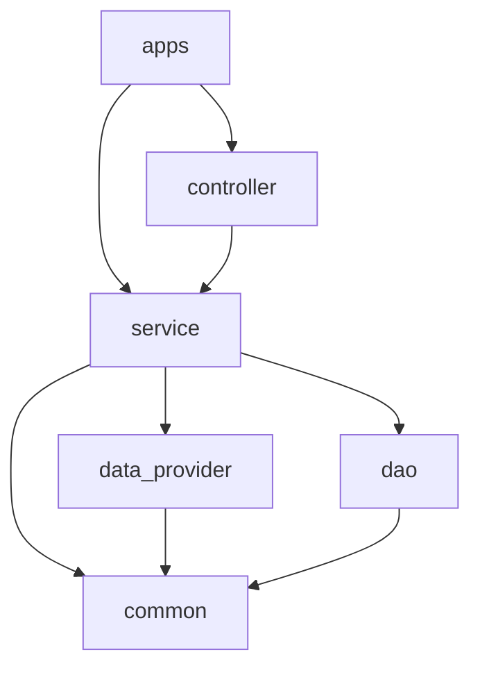
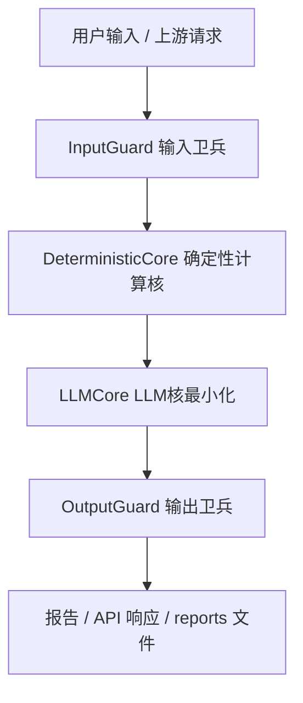

# stock_copilot 工程约定与架构

> 最后更新：2026-06-14  
> **本文档是工程结构、模块分层与编码约束的唯一真源。**  
> 阶段功能范围见 [docs/mrd/](../mrd/)；专项技术方案见 [docs/design/](../design/)（不含重复架构内容）。

## 变更记录

| 日期 | Change | 摘要 |
|------|--------|------|
| 2026-06-13 | merge-arch | 合并原 architecture.md 与工程约定；确立 ref/、flat src/、reports/、三层防御 LLM 规范 |
| 2026-06-13 | add-value-data-provider-v1 | 新增 dao 持久化层（SQLAlchemy + SQLite）；data_sources/db 配置节；importlib pytest 模式 |
| 2026-06-14 | fix-value-data-pipeline-e2e | fetch_all 签名统一；Baostock 季频参数修复；Provider 持久化解耦（防 SQLite 锁）；config_loader bootstrap；E2E 验收脚本与字段覆盖报告 |

---

## 1. 文档地位与优先级

| 文档 | 路径 | 职责 |
|------|------|------|
| **工程约定与架构（本文档）** | `docs/dev/engineering-conventions.md` | 目录结构、分层、依赖、编码、LLM 协作规范 |
| 市场需求 | `docs/mrd/` | 做什么、为谁做、阶段范围、验收标准 |
| 专项设计 | `docs/design/` | 功能级技术方案（如价值面接入），不重复架构分层 |
| LLM 质量规范 | [docs/agent-engineering-quality.md](../agent-engineering-quality.md) | 三层防御详细 Good/Bad Case 与代码示例 |
| OpenSpec 变更 | `openspec/changes/` | 变更提案与归档快照；**归档后须合并回 docs/** |

**冲突处理：** 架构/目录/依赖以本文档为准；业务需求以 MRD 为准；LLM 细节以 agent-engineering-quality 为准。

---

## 2. 技术栈与语言

| 类别 | 约定 |
|------|------|
| 运行时 | Python **>= 3.10**（见 [pyproject.toml](../../pyproject.toml)） |
| Web 框架 | FastAPI（规划）；交互入口当前在 `src/apps/`（CLI 优先） |
| 配置 | YAML（`config/app.yaml`），密钥走环境变量 |
| 测试 | pytest + `test/` 目录 |
| Lint | ruff（line-length 120） |
| 持久化 | SQLAlchemy + SQLite（`dao/`），`db.url` 配置可切换 MySQL |
| 数据依赖 | akshare >= 1.18.54、baostock >= 0.9.2、tushare >= 1.4.0（见 `requirements.txt`） |
| 脚本 | `scripts/*.sh` 仅 devops；`scripts/*.py` 可承载 E2E / 运维批处理；业务核心逻辑不放 scripts |
| 配置加载 | `src/common/config_loader.py`：加载 `config/app.yaml`（缺失时 bootstrap from example）；提供 `load_validation_stocks()` |
| 前端 | 是否建设 Web UI 由 MRD / OpenSpec 决定，不在本文档限定 |

---

## 3. 目录结构与模块职责

### 3.1 权威目录树

```text
stock_copilot/                    # 本 git 仓库根
├── config/                       # 应用配置（app.yaml 不入库）
├── docs/
│   ├── mrd/                      # 需求权威
│   ├── design/                   # 专项设计（不含重复架构）
│   └── dev/
│       └── engineering-conventions.md   # 本文档
├── log/                          # 运行日志（gitignore 内容，保留 .gitkeep）
├── reports/                      # 分析报告产出（gitignore 内容，保留 .gitkeep）
├── openspec/                     # 变更提案（非长期真源）
├── ref/                          # 外部参考 clone，整个目录不进 git
│   ├── FinanceToolkit/
│   ├── valueinvest/
│   └── daily_stock_analysis/
├── scripts/                      # 开发/部署脚本
├── src/                          # 唯一业务源码根（扁平，无 stock_copilot 子包）
│   ├── apps/                     # CLI / 交互入口
│   ├── controller/               # HTTP API
│   ├── service/                  # 领域编排
│   ├── data_provider/            # 外部数据适配
│   ├── dao/                      # 持久化
│   └── common/                   # 共享类型/工具/异常
└── test/                         # 测试（镜像 src/ 结构）
```

### 3.2 模块职责

| 模块 | 职责 | 依赖方向 |
|------|------|----------|
| `apps` | CLI、用户交互 | → controller（可选）、service |
| `controller` | REST/API 路由、请求校验、响应封装 | → service |
| `service` | 业务编排、领域逻辑 | → data_provider, dao, common |
| `data_provider` | 行情/财报/新闻等外部 API 适配 | → common |
| `dao` | ORM/Repository、持久化 | → common |
| `common` | 日志、配置加载、异常、工具、常量 | 无业务依赖 |

**service 建议子域（按业务扩展）：**

| 子域 | 职责 |
|------|------|
| `service/value/` | 价值面：估值原型路由、区间聚合 |
| `service/technical/` | 技术面：指标、趋势信号 |
| `service/report/` | 报告 Context 打包、LLM 编排、写入 reports/ |
| `service/guard/` | 决策护航：Checklist、红蓝对抗（MRD 定义范围） |

### 3.3 硬规则

- 业务代码**只在** `src/` 下；不在 `docs/`、`ref/`、`reports/` 写可执行逻辑
- `test/` 与 `src/` 目录结构对应（如 `test/service/test_value_analysis.py`）
- 新增顶层目录须先更新本文档 §3.1 再创建

### 3.4 import 约定

| 项 | 约定 |
|----|------|
| 源码根 | `src/`（pytest `pythonpath = ["src"]`） |
| import 示例 | `from service.value import ...`、`from apps.cli import ...` |
| **禁止** | `from stock_copilot.service import ...` |
| 版本号 | `from common.constants import __version__` |

---

## 4. 分层架构与数据流

### 4.1 分层图

```text
┌─────────────────────────────────────────────────────────┐
│  apps（CLI / Web 交互）                                   │
└───────────────────────────┬─────────────────────────────┘
                            │
┌───────────────────────────▼─────────────────────────────┐
│  controller（HTTP/API 路由，供 apps 调用）                │
└───────────────────────────┬─────────────────────────────┘
                            │
┌───────────────────────────▼─────────────────────────────┐
│  service（领域服务，可复用业务逻辑）                        │
│    ├── 价值面编排    ├── 技术面编排    ├── 报告/LLM 编排   │
└───────┬─────────────────────────────┬───────────────────┘
        │                             │
┌───────▼──────────┐         ┌────────▼────────┐
│  data_provider   │         │      dao        │
│  外部 API 数据    │         │   数据库读写     │
└──────────────────┘         └─────────────────┘
        │
┌───────▼──────────────────────────────────────────────────┐
│  common（工具、异常、常量、共享类型）                        │
└──────────────────────────────────────────────────────────┘
```

### 4.2 依赖规则



**允许：** 上层调用下层。

**禁止：**

- `dao` → `service` / `controller`
- `data_provider` → `service`
- `common` → 任何业务层
- 跨层跳级（如 `apps` 直接调 `data_provider`，须经 `service`）

### 4.3 分析请求数据流（目标态）

1. `apps` 发起分析请求
2. `controller` 校验参数（Input Guard），调用 `service`
3. `service` 并行调度价值面 + 技术面（经 `data_provider` 取数，确定性计算）
4. 结果打包后经 LLM 综合叙述（LLM Core 最小化）
5. Output Guard 校验后：写入 `reports/`；持久化需求时经 `dao` 写入

专项接入细节见 [value-analysis-integration.md](../design/value-analysis-integration.md)。

---

## 5. 外部参考仓库（ref/）

`ref/` 下三仓库为**设计参考 + 算法参考**，不是 runtime 依赖。

| 目录 | 用途 |
|------|------|
| `ref/daily_stock_analysis/` | 技术面、LLM 报告、YAML 策略参考 |
| `ref/valueinvest/` | 估值引擎（DCF/Graham/EPV 等）参考 |
| `ref/FinanceToolkit/` | 财务比率与模型参考 |

**允许：**

- 阅读源码、跑其 CLI 做对比验证
- 将必要算法/数据结构 **COPY** 到 `src/` 对应层
- 在 [docs/design/references/](../design/references/) 保留分析报告

**禁止：**

- `pip install -e ref/valueinvest` 或 `sys.path` 指向 `ref/`
- 任何 `import` 外部 clone 包
- 修改 `ref/` 下源码（视为只读快照）
- 将 `ref/` 内容提交进 stock_copilot git

**拷贝规范：**

- 目标路径按本工程分层（如 `src/service/value/`、`src/common/models/`）
- 文件头注释：来源仓库、原路径、commit/日期、许可证
- 拷贝后须补 `test/` 用例，视为本仓库代码维护
- 优先拷贝纯函数/模型，少拷贝整包 Controller

本地路径可在 `config/app.yaml` 的 `ref.*` 配置（仅便于人工查阅，不参与 import）。

---

## 6. 模块命名与代码风格

| 项 | 约定 |
|----|------|
| 文件 | `snake_case.py` |
| 类 | `PascalCase` |
| 函数/变量 | `snake_case` |
| 常量 | `UPPER_SNAKE`（放 `common/constants.py`） |
| 类型 | 新代码使用 type hints；公开 API 用 dataclass / Pydantic |
| 注释 | 中文或英文均可；docstring 说明非 obvious 业务逻辑 |
| 行宽 | 120（ruff） |

---

## 7. 配置、日志与环境变量

| 项 | 路径/约定 |
|----|-----------|
| 应用配置 | `config/app.yaml`（从 `config/app.example.yaml` 复制，不入库） |
| 日志目录 | `log/`，按日滚动，路径在配置中指定 |
| 报告目录 | `reports/`，见 §10 |
| 密钥 | 环境变量或 `config/app.yaml` 本地覆盖，**禁止提交** |

---

## 8. 测试约定

- 测试目录：`test/`（非 `tests/`）
- 命名：`test_<module>.py`，函数 `test_<scenario>`
- 确定性模块：**必须有单元测试**；外部 API 用 mock/fixture
- 网络测试：标记 `@pytest.mark.network`，CI 可选跑
- 运行：`pytest`（`pythonpath` 已配置为 `src`）

---

## 9. 确定性计算与 LLM 协作规范

> 框架来源：[docs/agent-engineering-quality.md](../agent-engineering-quality.md)  
> 优先级：**鲁棒性 > 稳定性 > 消耗**

### 9.1 三层防御架构



| 层 | 实现 | 职责 |
|----|------|------|
| **Input Guard** | 纯代码，零 token | 参数校验、股票代码标准化、超长截断、Session 边界 |
| **Deterministic Core** | `service/` + `data_provider/` | 价值/技术/情绪数值计算 |
| **LLM Core** | 最小化 | 叙述、红蓝对抗、歧义澄清 |
| **Output Guard** | 纯代码 | Schema 校验、关键字段非空、重试上限、幂等缓存 |

### 9.2 确定性计算核 — 代码负责

以下输出**必须**由确定性模块计算，**禁止 LLM 生成或修改**：

| 类别 | 示例字段 |
|------|----------|
| 价值面 | `fair_value_range`、`margin_of_safety`、`price_percentile`、`piotroski_f`、`altman_z` |
| 技术面 | `signal_score`、`trend_status`、`buy_signal`、MA/MACD/RSI 数值 |
| 情绪面 | 情绪分位、极端贪婪/恐惧等级 |
| 元数据 | 数据来源、时效、基于数据完整度的 confidence（非 LLM 自评） |

**代码 vs LLM 分工：**

| 任务 | 用代码 | 用 LLM |
|------|--------|--------|
| 估值区间 / 技术指标计算 | ✅ | ❌ |
| 参数完整性校验 | ✅ | ❌ |
| JSON 解析 | ✅ Pydantic | ❌ |
| 报告模板填充（固定结构） | ✅ Jinja2 / 模板 | ❌ |
| 数值比较、分位、加权评分 | ✅ | ❌ |
| 业务叙述、多空论述 | ❌ | ✅ |
| 歧义澄清、Checklist 引导 | ❌ | ✅ |

### 9.3 输入卫兵（Input Guard）

- 分析请求须校验 `code`、分析类型等；缺失立即拒绝，不让 LLM 猜
- A 股/港/美 ticker 在进入 pipeline 前统一格式（纯代码）
- Context 打包时对新闻/文档超阈值做截断或摘要
- 关键参数（股票代码、分析模式）通过显式 context 注入，不从对话历史推断
- 数据源 API 重试在 `data_provider/` 代码层（指数退避 + 上限）

### 9.4 LLM 核最小化（LLM Core）

- LLM 输出须符合 Pydantic / JSON schema，禁止自由文本作为最终产出
- 输出含 `confidence`（0–1）：`< 0.6` 触发澄清，`< 0.8` 标注警告
- 含 `ambiguity_detected` 为 true 时暂停并追问用户
- LLM prompt 只接收确定性结果摘要，须明确「不得修改数值字段」
- 模型选型配置化，不写死具体型号

### 9.5 输出卫兵（Output Guard）

- LLM JSON 过 Pydantic 校验；失败重试最多 2 次，超限终止
- 关键字段 null/空 → 终止，不静默传播
- 相同输入可缓存 LLM 叙述结果（幂等 hash）
- `max_retry=2`、`max_turns=20`、`timeout_seconds` 可配置
- 校验失败时**不得**把残缺输出写入 `reports/` 或返回给用户

### 9.6 三角权衡摘要

| 场景 | 决策 |
|------|------|
| 增加输入校验但 latency +50ms | ✅ 加，鲁棒优先 |
| 用 LLM 做参数校验 | ❌ 用代码 |
| 校验失败静默继续 | ❌ 终止或重试 |
| LLM 低置信度静默往下传 | ❌ 澄清或警告 |
| 让 LLM 生成估值/指标数值 | ❌ 绝对禁止 |

详细 Good/Bad Case 见 [agent-engineering-quality.md](../agent-engineering-quality.md)。

---

## 10. 报告产出（reports/）

| 项 | 约定 |
|----|------|
| 用途 | 存放系统运行产出的分析报告（Markdown / JSON / HTML 等） |
| 路径 | `reports/{yyyy}/{mm}/{code}_{timestamp}.{ext}` 或 `reports/{run_id}/`（由 `service/report/` 统一） |
| Git | 目录内容 gitignore；仅 `reports/.gitkeep` 入库 |
| 写入方 | 仅 `service/report/`（或等价模块）；**不由 LLM 直接写文件** |
| 与日志区别 | `log/` = 运行日志；`reports/` = 用户可读分析产物 |

---

## 11. 文档与 OpenSpec 工作流

1. 需求与设计长期真源在 `docs/mrd/` 与 `docs/design/`
2. 变更流程：OpenSpec explore → propose → apply → archive
3. **归档后须合并回 docs/**（见 [docs/README.md](../README.md)）
4. 架构/目录/依赖变更须同步更新**本文档**与 `openspec/config.yaml`

---

## 12. AI / 代码生成硬规则

动手前须阅读：

1. 本文档（`docs/dev/engineering-conventions.md`）
2. 相关 MRD feature 文档（如 [value-analysis.md](../mrd/features/value-analysis.md)）
3. 涉及 LLM 时：[agent-engineering-quality.md](../agent-engineering-quality.md)

编码时：

- 只改 `src/` 和 `test/`，不碰 `ref/` 下 clone 仓库
- 不擅自新增顶层目录；新模块须符合 §3、§4 分层
- 不提交 `config/app.yaml`、`.env`、密钥
- 不在 README 堆细节；细节进 `docs/`
- commit message 使用英文（若用户要求 commit）

---

## 13. 相关文档索引

| 文档 | 说明 |
|------|------|
| [product-overview.md](../mrd/product-overview.md) | 产品总览与三维分析框架 |
| [value-analysis.md](../mrd/features/value-analysis.md) | 价值面专项需求 |
| [value-analysis-integration.md](../design/value-analysis-integration.md) | 价值面接入方案 |
| [agent-engineering-quality.md](../agent-engineering-quality.md) | LLM 三层防御详细规范 |
| [design/references/](../design/references/) | 外部项目模块分析报告 |
| [openspec-best-practices.md](openspec-best-practices.md) | OpenSpec 工作流 |
