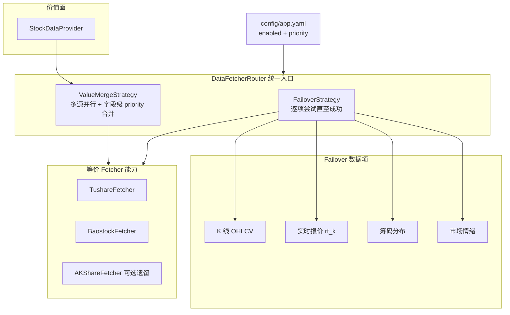

# 数据源架构迁移与 AKShare 退役

> 最后更新：2026-08-08  
> 状态：**需求草案（待 OpenSpec 立项）**  
> 关联 Issue：[#1 KlineProvider 不支持 Tushare](https://github.com/chenghan7113029/stock_copilot/issues/1)  
> 读者：产品 Owner、实现 Agent、Reviewer

---

## 变更记录

| 日期 | 摘要 |
|------|------|
| 2026-08-08 | 初稿：三阶段拆分（架构统一 / Tushare 对齐 / AKShare 退役）；对齐 Owner 对多源合并、实时 `rt_k`、默认配置与 Baostock 财报字段策略的决策 |

---

## 1. 背景与问题陈述

### 1.1 代码架构 vs 运行现实

当前代码中的隐含顺序（类默认 `priority`、K 线硬编码、旁路 Provider 单绑 AKShare）大致为：

**AKShare → Baostock → Tushare**

实际生产可用性（Owner 实测）为：

**Tushare → Baostock → AKShare**

AKShare 的问题不是「配置未启用」，而是**接口长期不稳定、维护停滞、调用频繁超时**。继续将其作为默认主源或旁路强依赖，会拖垮 `sync`、`sync market`、`sync --realtime` 等核心路径。

### 1.2 架构分裂现状

| 联网路径 | 选源机制 | 遵从 `data_sources.enabled` + `priority` |
|----------|----------|-------------------------------------------|
| 价值面 `StockDataProvider` | 多源合并（各源 `fetch_all` 后按字段合并） | 部分遵从（enabled ✓；合并顺序应严格按 priority） |
| K 线 `KlineProvider` | 硬编码 Baostock → AKShare | **否**（Baostock 无条件实例化；不走 Tushare） |
| 实时叠加 `RealtimeOverlayProvider` | 仅 AKShare | **否**（无参构造默认 `AKShareFetcher()`） |
| 筹码 `ChipDistributionProvider` | 仅 AKShare | 仅 `is_data_source_enabled(akshare)` 门控 |
| 情绪 `MarketSentimentProvider` | 仅 AKShare | 同上；`sync market` 无 akshare 则 **exit 1** |

Tushare 在价值面 fetcher 中已实现行情/财报能力，但 **K 线、实时、筹码、情绪四条旁路从未接入**，导致 Owner 感知「Tushare 从未调用成功」——根因是配置未默认启用 + 旁路未走 Tushare，而非 Token 本身必然无效。

### 1.3 为何拆成三个阶段

一次性替换 AKShare **改动面大、回归风险高**（价值面合并、K 线缓存、筹码表、情绪快照、CLI 门控、E2E、默认配置、bootstrap）。建议分三阶段交付，每阶段可独立验收、可回滚：

1. **阶段 A — 数据源架构统一**：统一选源/router 语义，不改默认源组合亦可先落地框架  
2. **阶段 B — Tushare 对齐 Baostock**：在统一架构上补齐 Tushare 能力矩阵，使 `tushare + baostock` 可独立运行核心链路  
3. **阶段 C — 去除 AKShare 依赖**：默认配置与实现路径完全脱离 AKShare，代码保留但默认不启用

---

## 2. 已确认设计决策（Owner 对齐）

| # | 决策 | 说明 |
|---|------|------|
| D-1 | **代码层数据源等价** | Fetcher 类不写死运行态 priority；顺序仅来自 `config/app.yaml` |
| D-2 | **价值面保留多源合并** | 所有 enabled 源各拉取一次；**字段合并严格按配置 priority**（高优先级先写，低优先级不覆盖已有字段） |
| D-3 | **其他数据项用 failover** | K 线、实时报价、筹码、情绪等：**按 priority 依次尝试，成功即停；全失败则该数据项更新失败**（或文档约定的降级，见 §5） |
| D-4 | **实时行情** | Tushare 使用 **`rt_k`**；失败则 failover 下一源；**禁止用 `daily` 冒充盘中实时** |
| D-5 | **Baostock 无实时能力** | Baostock 仅能提供最近交易日收盘价（历史日 K 末行），**不能**作为 `sync --realtime` 的 failover 源；Tushare `rt_k` 失败后降级为 **EOD + 警告** |
| D-6 | **AKShare 门控** | 配置未启用 → **不实例化、不调用**；`import akshare` 可保留 |
| D-7 | **默认配置目标态** | `tushare(priority=1) + baostock(priority=2)`；**默认完全去掉 akshare** |
| D-8 | **财报字段特例改造** | 见 §3；废除 merge 阶段 `override_field` 补丁，改为 **Baostock 不拉取/不产出** 低可信度财报字段 |

---

## 3. 财报字段特例说明与改造方向（D-8）

### 3.1 现状

`StockDataProvider._merge_fields` 对 `FINANCIAL_STATEMENT_FIELDS` 中的字段，若来源为 `tushare` 则调用 `override_field`，**无视**已 merge 的高优先级 Baostock 值：

```python
FINANCIAL_STATEMENT_FIELDS = {
    "revenue", "fcf", "capex", "net_debt", "ebit", "depreciation",
    "total_assets", "total_liabilities", "bvps", "roic", "net_income",
}
```

根因：Baostock 对上述字段大量依赖**季频接口 + 推导链**（如 FCF：`operCashTTM → CFOToOR×revenue → net_income×fcf_rate`），与 Tushare 年报/财报接口的**真值口径**不一致。`override_field` 是事后补丁，语义上等价于承认：**这些字段的 Baostock 值不可信，不应进入合并结果。**

### 3.2 目标（Owner 确认）

- **删除** merge 阶段 Tushare `override_field` 特例  
- **改为在 BaostockFetcher 侧**：对上述字段**不拉取、不写入** `FetchResult.data`（或显式标为 missing），避免误用  
- 合并完全遵循 priority：若 `tushare(1) + baostock(2)`，Tushare 先写，Baostock 仅补 Tushare 缺失字段  
- 需附**字段级矩阵文档**（见阶段 B），标明各源对各字段的支持级别：`native` / `derived` / `unsupported`

---

## 4. 目标架构（三阶段完成后的终态）



### 4.1 能力矩阵（终态目标）

| 数据项 | Tushare | Baostock | AKShare（阶段 C 后） |
|--------|---------|----------|---------------------|
| 价值面行情+财报 | ✅ 主 | ✅ 补位 | ❌ 默认禁用 |
| K 线 | ✅ `pro_bar(qfq)` | ✅ `fetch_kline` | ❌ |
| 实时报价 | ✅ `rt_k`（需权限） | ❌ | ❌ |
| 筹码 | ⚠️ `cyq_perf`（5000 分）或降级 | ❌ | ❌ 退役 |
| 市场情绪 | ✅ `margin` + `daily` 聚合等 | ❌ | ❌ 退役 |
| `industry` | ✅ `stock_basic` | ❌ | ❌ |
| 银行专项指标 | ✅ `fina_indicator` | 弱/缺 | ❌ |

---

## 5. 三阶段需求拆分

### 阶段 A — 数据源架构统一

**建议 OpenSpec change**：`unify-data-source-router`

#### 5.A.1 目标

建立**唯一选源真源**（`DataFetcherRouter` 或扩展 `SourceManager`），消除 K 线/实时/筹码/情绪与价值面的架构分裂；**本阶段不要求去除 AKShare**，但所有路径必须遵从 `enabled` + `priority`。

#### 5.A.2 范围

**In**

- 新建 Router：读取 `data_sources.enabled`，按 `priority` 排序实例化 fetcher（复用 `SourceManager._build_fetcher`）
- 定义能力协议（Protocol）：`fetch_all` / `fetch_kline` / `fetch_realtime_quote` / `fetch_chip_distribution` / `fetch_market_sentiment`（后两者可先声明不支持）
- **ValueMergeStrategy**：保持现有多源并行；合并顺序 = priority；移除 fetcher 类上的硬编码 `priority` 默认值作为运行依据（可保留为文档默认，仅 config 缺失时使用）
- **FailoverStrategy**：供 K 线、实时等调用；记录实际命中源（`kline_source=` / `quote_source=`）写入日志与 sync 进度
- 重构 `KlineProvider`：不再无条件 `BaostockFetcher()`；源列表来自 Router
- 重构 `RealtimeOverlayProvider`：禁止无参默认 AKShare；由 Router 注入 failover 链
- `ChipDistributionProvider` / `MarketSentimentProvider`：构造必须经过 `from_config` / Router；默认 `use_akshare=False`
- 单测：mock 验证 priority 顺序、enabled 门控、failover 行为

**Out**

- Tushare 新接口实现（阶段 B）
- 删除 AKShare 代码（阶段 C）
- 修改默认 `app.example.yaml` 为无 akshare（阶段 C，或 A 末预览开关）

#### 5.A.3 验收标准

- [ ] `enabled` 仅 `baostock` 时，**零 AKShare 网络调用**（含实时、筹码、情绪路径）
- [ ] K 线 failover 顺序与 config priority 一致（可用 mock 断言调用顺序）
- [ ] 价值面 merge 顺序与 priority 一致；**删除** `override_field` 特例（可与阶段 B 字段矩阵同步交付）
- [ ] 现有 `pytest -q -m "not network"` 全绿
- [ ] 文档：在本文档 §4 架构图落地，并更新 `engineering-conventions.md` 数据源小节（若分层有变）

#### 5.A.4 风险

- 重构 `KlineProvider` 可能影响所有 `report tech/dual` 离线路径 → 需保持 SQLite 缓存契约不变
- Router 与现有 `SourceManager._fetch_with_fallback`（价值面未使用）语义易混淆 → 明确废弃或重命名

---

### 阶段 B — Tushare 对齐 Baostock

**建议 OpenSpec change**：`align-tushare-coverage`（可再拆子 change）

#### 5.B.1 目标

在阶段 A 的统一 Router 上，使 **`tushare + baostock` 可完成核心联网链路**（`sync`、价值面、`report tech`），不依赖 AKShare。

#### 5.B.2 范围

**In**

| 能力 | 实现要点 | 优先级 |
|------|----------|--------|
| K 线 | `TushareFetcher.fetch_kline`：`pro_bar(adj='qfq')`，字段对齐 Baostock/AKShare | P0（Issue #1） |
| 实时报价 | `TushareFetcher.fetch_realtime_quote`：`pro.rt_k`；无权限时明确失败并 failover/降级 | P0 |
| Baostock 财报字段收敛 | Baostock **不产出** §3 `FINANCIAL_STATEMENT_FIELDS`（或标 missing） | P0 |
| 字段能力矩阵 | `docs/design/data-source-field-matrix.md`：每字段每源 `native/derived/unsupported` | P0 |
| 价值面 | 确认 Tushare 已覆盖字段在 `tushare(1)` 下主导 merge | P1 |
| 情绪 V1 替代 | `TushareSentimentFetcher`：`margin`（2000 分）+ `daily(trade_date)` 聚合涨跌停近似；两融环比 | P1 |
| 筹码 | 评估 `cyq_perf`（**5000 积分**）；未达标则维持「跳过+缓存降级」并文档化 | P2 |
| bootstrap | `cloud_bootstrap`：有 token 时写入 `tushare priority=1`，不再默认插入 priority=3 | P1 |
| 网络 E2E | 扩展/新增 `test_tushare_kline`、`verify_rt_k`（权限不足则 skip 并说明） | P1 |

**Out**

- 完全删除 AKShare（阶段 C）
- `cyq_chips` 全价位分布（需 5000 分且与 AKShare 字段差异大）
- `limit_list_d` 精确涨跌停（5000 分）— 可用聚合近似替代

#### 5.B.3 Tushare 积分与权限说明（Owner：2000+ 积分）

| 接口 | 用途 | 2000 积分 | 备注 |
|------|------|-----------|------|
| `pro_bar` / `daily` | K 线 | ✅ | 历史；`pro_bar` 前复权 |
| `rt_k` | 盘中实时日 K | ⚠️ **单独月费权限** | 非积分自带；需 Owner 在权限中心开通 |
| `margin` | 两融汇总 | ✅ | 情绪分量 |
| `daily` 全市场 | 涨跌停近似统计 | ✅ | 按 `pct_chg`/涨跌停幅度聚合 |
| `cyq_perf` | 筹码胜率 | ❌ 需 5000 | 阶段 B 可文档化降级 |
| `limit_list_d` | 精确涨跌停列表 | ❌ 需 5000 | 用聚合近似 |

#### 5.B.4 验收标准

- [ ] Issue #1 关闭：`sync 600519` 在仅 `tushare+baostock`、Baostock 不可用时，K 线仍可通过 Tushare 拉取
- [ ] `sync --realtime`：已开通 `rt_k` 时使用 Tushare 实时；未开通则 **EOD 降级 + 明确警告**（不静默用 daily）
- [ ] 价值面：样本股 `600519` 在 `tushare(1)+baostock(2)` 下，`industry`/银行指标来自 Tushare；Baostock 不污染 §3 财报字段
- [ ] `sync market` 在无 AKShare、有 Tushare 时可写入情绪快照（允许部分分量 missing + 降级）
- [ ] 字段矩阵文档与实现一致

#### 5.B.5 风险

- `rt_k` 未开通时实时同步体验下降 → CLI 进度与文档必须明示
- Tushare `pro_bar` 与 Baostock 前复权口径可能存在微小差异 → 技术面仅作趋势参考，报告保留 `kline_source` 水印
- 涨跌停「聚合近似」与 AKShare legu 数值不完全一致 → 情绪指数需重新标定或接受偏差

---

### 阶段 C — 去除 AKShare 依赖

**建议 OpenSpec change**：`retire-akshare-default`

#### 5.C.1 目标

默认产品与配置**完全不依赖 AKShare**；AKShare fetcher 代码保留为可选遗留源（便于对比测试或紧急回退），但：

- 默认 `app.example.yaml` / bootstrap 模板：**仅** `tushare(1) + baostock(2)`
- 所有生产路径不实例化 AKShare
- 移除对 AKShare 的**硬错误**（如 `sync market` 要求必须启用 akshare）

#### 5.C.2 范围

**In**

- 更新 `config/app.example.yaml`、`cloud_bootstrap.py`、相关注释
- `apps/cli.py`：`sync market` 改为基于 Router 的源可用性检查，而非 `is_data_source_enabled(akshare)` 硬编码
- 删除或改写仅 AKShare 适用的用户可见文案（「依赖 AKShare」→「依赖已配置数据源」）
- 测试：移除或隔离 `test_akshare_fetcher` 网络依赖；CI 默认不启 AKShare
- 文档：`roadmap-todo.md`、`product-overview.md` 数据源描述更新
- 依赖声明：`akshare` 可降为 optional extra（`pip install stock_copilot[akshare]`）— **可选**，视 packaging 成本决定

**Out**

- 从仓库物理删除 `src/data_provider/akshare/`（可保留 1–2 个版本作遗留）
- 重写历史 OpenSpec 归档文档

#### 5.C.3 验收标准

- [ ] 全新 bootstrap 后 `config/app.yaml` 无 akshare 条目
- [ ] 全量 `pytest -q -m "not network"` 无 AKShare 实例化
- [ ] `trial_cli_workflow.py`（或等价全流程）在 `tushare+baostock` 下跑通
- [ ] grep 生产路径 `AKShareFetcher()` 无参构造 = 0
- [ ] Owner 验收：Cloud/本地在无 AKShare 环境下 `sync` / `report tech` / `report dual` / `sync market` 可用（允许筹码/部分情绪降级）

#### 5.C.4 风险

- 遗留测试/文档大量提及 AKShare → 需批量清理说明，避免 Agent 误用
- 若 Tushare 全站故障，失去 AKShare 紧急回退 → 保留 config 手动加回 akshare 的文档化回滚步骤

---

## 6. 阶段依赖关系


- **A 可独立交付**：即使仍临时保留 akshare 在配置中，也应先统一 Router  
- **B 依赖 A**：Tushare 新能力必须挂在统一 failover/merge 上  
- **C 依赖 B**：去除 AKShare 前必须有 Tushare 替代（至少 K 线+实时+情绪 V1）

**Issue #1** 归属：**阶段 B 的 P0 子项**（实现可先在阶段 A 分支上开发，但验收以 B 为准）。

---

## 7. 影响面评估（供排期参考）

| 模块/资产 | 阶段 A | 阶段 B | 阶段 C |
|-----------|--------|--------|--------|
| `data_provider/manager.py` | 重构/扩展 | 小改 | 小改 |
| `data_provider/kline_provider.py` | **大改** | 中（+Tushare） | 小 |
| `data_provider/provider.py` | 中（去 override） | 中（字段矩阵） | 小 |
| `data_provider/tushare/fetcher.py` | 小 | **大改** | 小 |
| `data_provider/baostock/fetcher.py` | 小 | **中**（字段收敛） | 小 |
| `realtime_overlay_provider.py` | **中** | 中（rt_k） | 小 |
| `chip_distribution_provider.py` | 中 | 中/可选 | 中 |
| `sentiment/*` | 中 | **大**（新 Tushare fetcher） | 中 |
| `apps/cli.py` | 小 | 小 | 中 |
| `config/app.example.yaml` | — | 预览 | **改默认** |
| `scripts/cloud_bootstrap.py` | 小 | 中 | 中 |
| `test/**` | 大 | 大 | 中 |
| `docs/mrd/roadmap-todo.md` | 小 | 中 | 中 |

**粗粒度**：阶段 A ≈ 架构债清理；阶段 B ≈ 功能补齐（工作量最大）；阶段 C ≈ 配置/测试/文档扫尾 + 默认切换。

---

## 8. 非目标（本迁移不做）

- 协方差矩阵 / 组合优化级行情数据  
- Web API 层（`controller/`）  
- 将价值面从「多源合并」改为「单源 failover」（Owner 已确认保留合并）  
- 物理删除 AKShare 源码（阶段 C 仍为可选遗留源）  
- 保证与 AKShare 历史数值 100% 一致（源切换后允许可解释偏差）

---

## 9. 开放问题（后续 OpenSpec 前需闭合）

| ID | 问题 | 建议决策时点 |
|----|------|-------------|
| OQ-1 | `rt_k` 月权限是否已开通？未开通时 `sync --realtime` 是否接受永久 EOD 降级？ | 阶段 B 启动前 Owner 确认 |
| OQ-2 | 筹码：是否投入冲 5000 积分接 `cyq_perf`，还是长期接受「无筹码联网」？ | 阶段 B 排期前 |
| OQ-3 | 情绪涨跌停近似 vs `limit_list_d` 精度要求 | 阶段 B 设计评审 |
| OQ-4 | `akshare` 是否从 `requirements.txt` 移至 optional extra | 阶段 C |
| OQ-5 | Router 命名与落点：`SourceManager` 扩展 vs 新建 `DataFetcherRouter` | 阶段 A 设计 1 页 |

---

## 10. 建议 OpenSpec 立项顺序

1. `/opsx-propose unify-data-source-router` — 阶段 A  
2. `/opsx-propose align-tushare-coverage` — 阶段 B（含 Issue #1）  
3. `/opsx-propose retire-akshare-default` — 阶段 C  

每个 change 归档时合并 delta 至：

- 本文档（状态勾选）  
- `docs/design/data-source-field-matrix.md`（阶段 B 新建）  
- `docs/mrd/roadmap-todo.md`（变更记录）  
- `docs/dev/engineering-conventions.md`（数据源分层，若有变）

---

## 11. 附录：当前 AKShare 独占路径速查

| 场景 | 文件 | 接口/行为 |
|------|------|-----------|
| K 线备源 | `kline_provider.py` | `AKShareFetcher.fetch_kline` |
| 实时报价 | `realtime_overlay_provider.py` | `fetch_realtime_quote` → `stock_zh_a_spot_em` |
| 筹码 | `akshare/fetcher.py` | `stock_cyq_em` |
| 涨跌停家数 | `akshare_sentiment_fetcher.py` | `stock_market_activity_legu` / 涨跌停池 |
| 两融环比 | 同上 | `macro_china_market_margin_sh/sz` |
| 换手率分位 | 同上 | `stock_zh_a_spot_em` 横截面 |
| 价值面 | `manager.py` | `AKShareFetcher.fetch_all`（合并路径） |

阶段 C 完成后，上表除「价值面可选遗留」外均应不再出现在默认运行路径中。
